# My Portofolio Project

portfolio is a personal website designed to showcase My skillset, past projects, and personality. It’s like answering the classic interview question, “Why should we hire you?” by providing illustrative examples of My work. As a front-end developer, My portfolio serves as a place to display code, projects, and UI/UX sensibilities. By hosting my code on a public repository, I am allowing others to see my code, and my work.


This portofolio project is deployed via Vercel and use Custom Domain using NiagaHoster

## Screenshots


### Built on 

- 💻 [Html](https://www.typescriptlang.org/)

- 🚀 [CSS](https://nextjs.org/)

- ⚛️ [Javascript](https://reactjs.org/)


## Table of Contents

- [Installation](#Installation)
- [Deployment](#deployment)
- [Domain Configuration](#Domain)


<a id="Installation"></a>

## Installation

Install my-project with this following step

```bash
  Go to https://github.com/samuelindraw/module-2-samuelindraw
  Git Clone https://github.com/samuelindraw/module-2-samuelindraw
  Open index.html or launch it with live server on visual studio code 
```

We are very happy if you are interested and also contributing to My portofolio project 🤗

Here are a few options:

- Star this repo.

- Create issues every time you feel something is missing or goes wrong.


### Header info
| Header | Description |
| --- | --- |
| `Home` | Home is an introduction page |
| `About` | Helping you to tell who your really are, whats your hobby etc |
| `Contact` | Where people can reach out to you! |


<a id="deployment"></a>


# Deployment

if you want your website to be accessible to other people you need to deploy it. 
in this case i was using vercel to deploy my website.


what is vercel ? 


Vercel is a powerful cloud platform that simplifies web development and deployment for frontend developers. 

## Deployment Step

### Register on Vercel
>You can register using Github account 

Step 1: After register you will see dashboard of vercel site\
Step 2: You can see, Your repository that connected to your github account and recent project\
Step 3: You can also add new project by clicking Add New\

<br> 


<br>

### Connect and Deploy Your Repository
>Connect to your own github repository


<br>

#### Step 1: Fork project `https://github.com/revou-fsse-5/module-2-samuelindraw`

> Vercel cannot takes from private repository, while revou repository is private so we mush clone to our public repository.


<br>

#### Step 2: Locate to Project folder
> After forking from RevoU repository we need to create Project and Import our git repository to Configure Project 

<br>


<br> 
<br> 


#### Step 3: Configure Project 
> We need to configure our project, By Choosing repository name and set framework that we use, if we only use html or css we can use other option.

* insert Project Name 
* Choose Framwork
* Deploy 

<br>


<br>
<br>

> here is what you see, when deployment was success

<br>

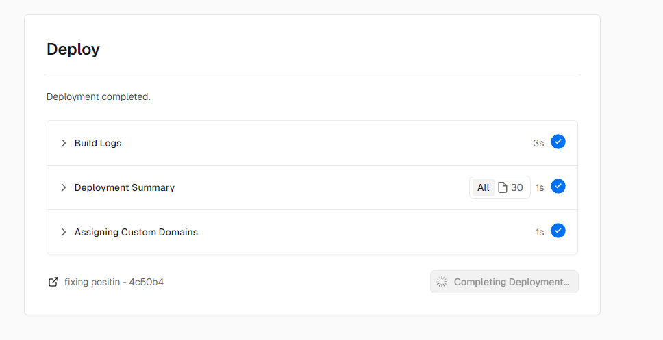

<br>
<br>

#### Step 4: Configure Deploy Site
> You can change domain or anything else after we finish deployment


<br> 

* Check your project and click the settings 
* You will see more action on left side, choose domain
* And there you can change vercel domain
<br>

<a id="Domain"></a>

# Domain Configuration

Why we need domain ? 
>A domain is like your website’s street address. It’s the unique reference that identifies your website online. When customers type it into their browsers, they find your site. 

## Step 1 : Register and Login at Niaga Hoster
> you can register and login using your own gmail / github email

<br>

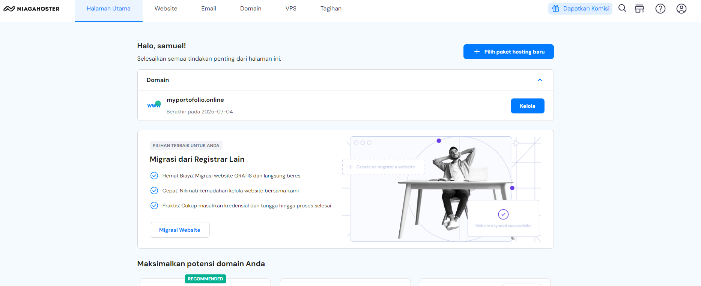

<br>
<br>

## Step 2 : Go to domain tab and search whenever domain that you will use.\
`how to choose domain name`
* Prioritize Brandability: A unique, brandable domain stands out. 
* Keep It Short: Shorter domain names are easier to remember.

<br>

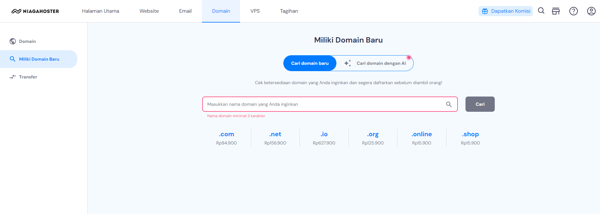

<br>
<br>

## Step 3 : Buy domain that suites you 

1. You can pay using virtual account, bank transfer or etc
2. After that you can verify your email.
3. Check Dashboard and see if your domain name is activated

<br>

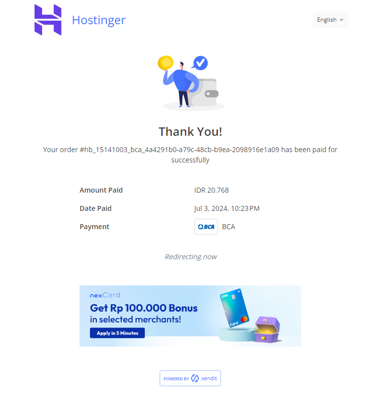

<br>
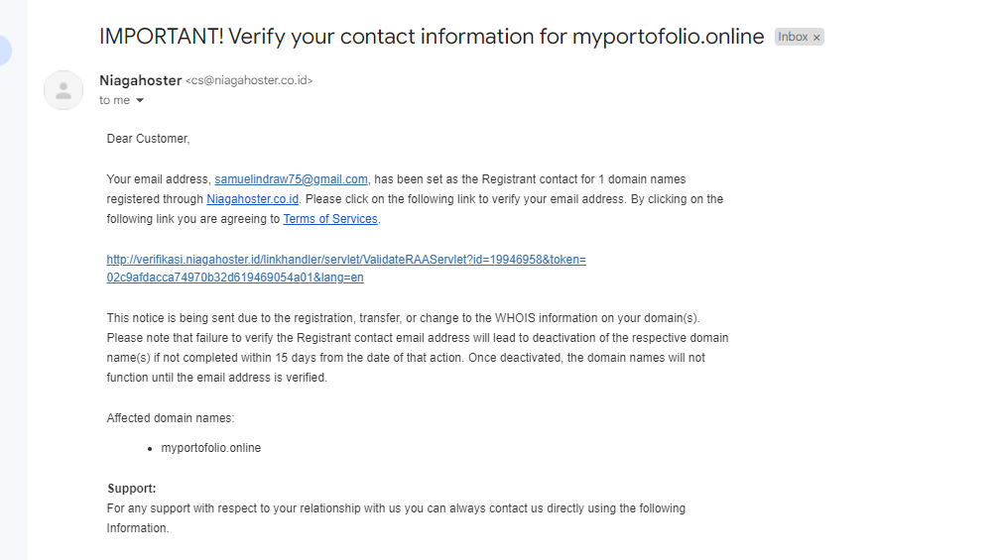
<br>


## Step 4: Setup Custom Domain

1. On vercel, Click your recent project and click Domain

<br>

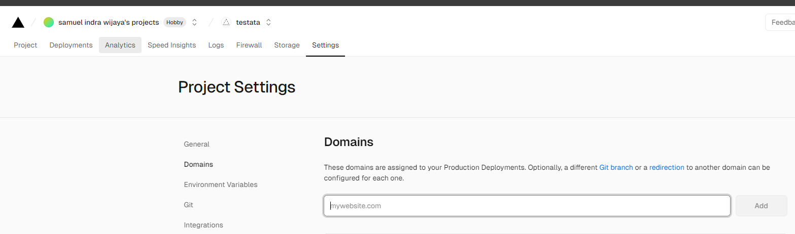

<br>

2. Your can add your custom domain, Domain provider that you have buy.

<br>

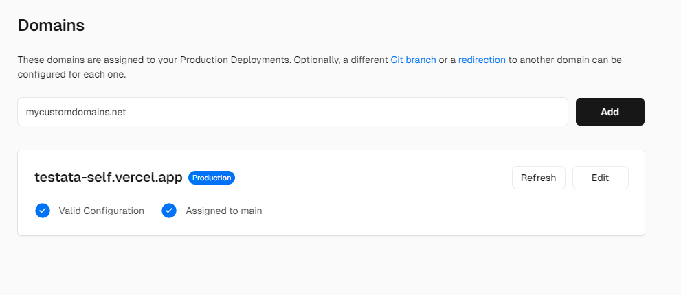

<br>

<br>

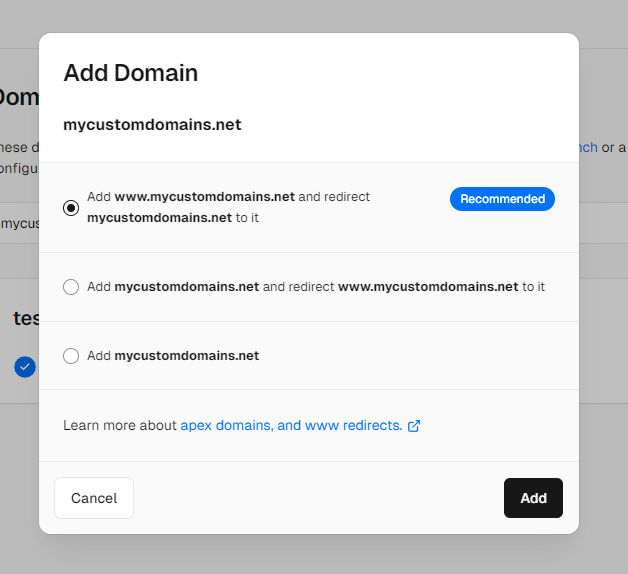

<br>

3. After adding custom domain, you will see that there 
was a list your custom domain, with some notice 
> [!CAUTION]
> Invalid configuration.

<br>

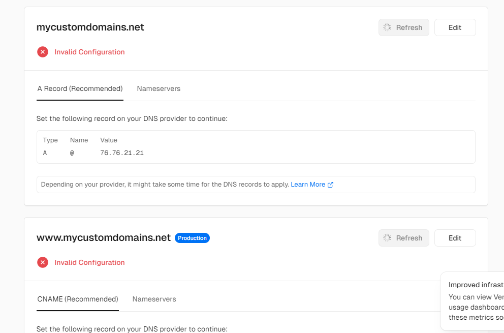

<br>

4. Connect Vercel DNS to Domain Hosting \
1 On name server choose use vercel DNS \
2 Then Look at set the names apex domain to\
3 Copy that and configure it on your custom domain site

<br>

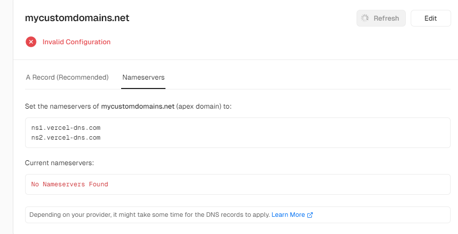

<br>

<br>

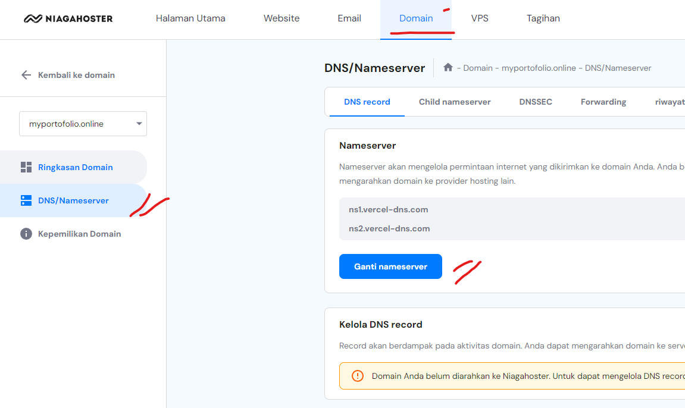

<br>

# DONE !!!

> [!TIP]
> AND YOU ARE SET, JUST WAIT AND YOU CAN USE YOUR CUSTOM DOMAIN !!! 

## deployment link

# DEPLOYMENT LINK
> [!IMPORTANT]
> This is my deployment link.
https://myportofolio.online/
https://portofoliositeme.vercel.app/


