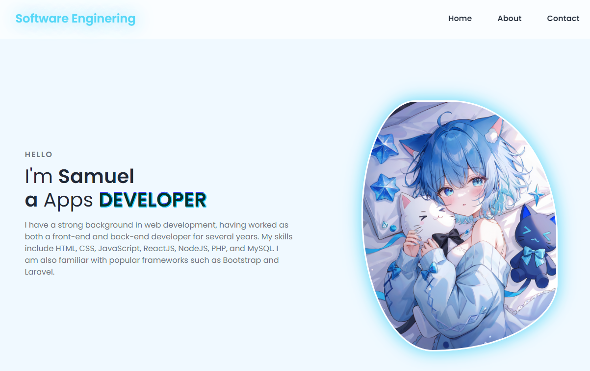
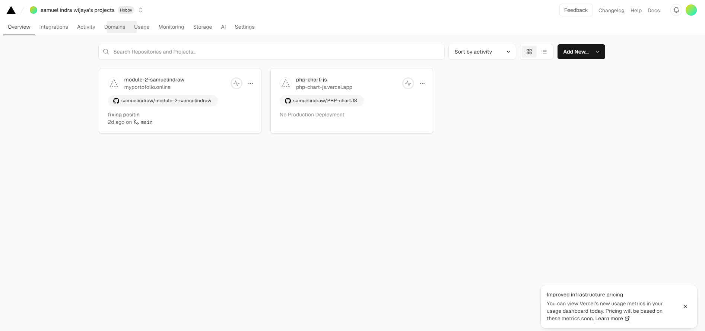
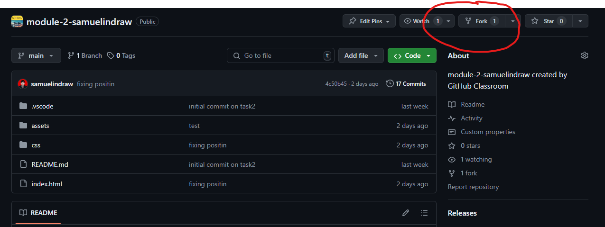
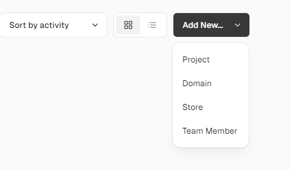
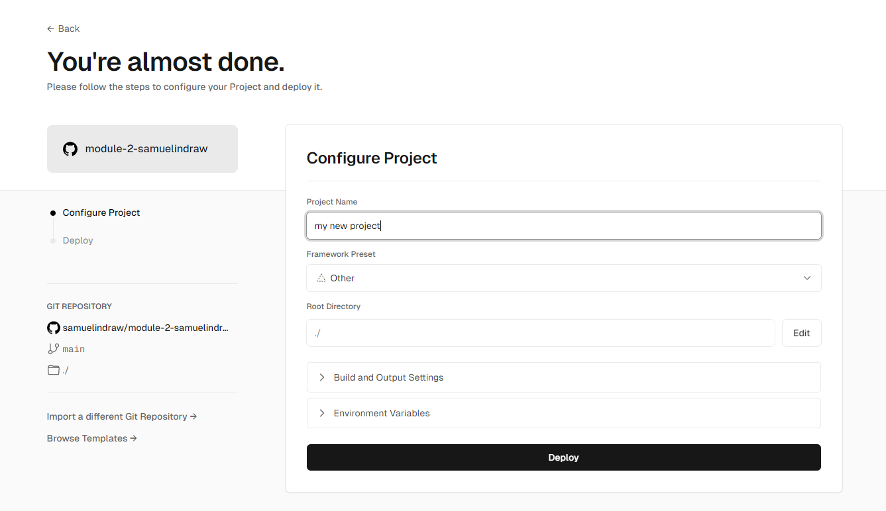
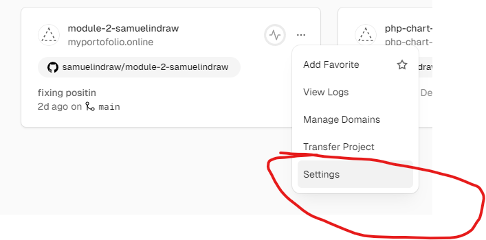
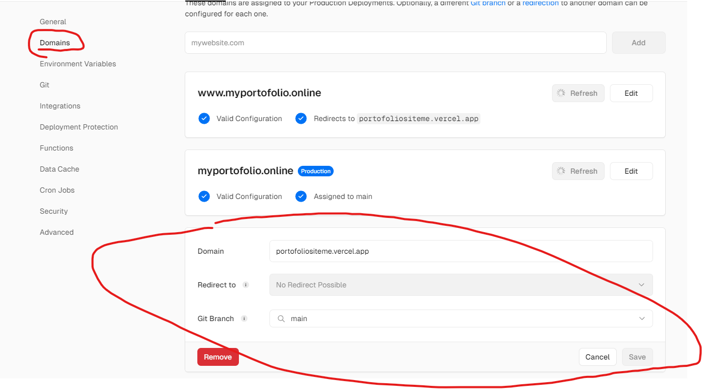

# My Portofolio Project

portfolio is a personal website designed to showcase My skillset, past projects, and personality. It’s like answering the classic interview question, “Why should we hire you?” by providing illustrative examples of My work. As a front-end developer, My portfolio serves as a place to display code, projects, and UI/UX sensibilities. By hosting my code on a public repository, I am allowing others to see my code, and my work.


This portofolio project is deployed via Vercel and use Custom Domain using NiagaHoster

## Screenshots




### Built on 

- 💻 [Html](https://www.typescriptlang.org/)

- 🚀 [CSS](https://nextjs.org/)

- ⚛️ [Javascript](https://reactjs.org/)


## Table of Contents

- [Installation](#Installation)
- [Deployment](#deployment)
- [Domain Configuration](#Domain)


<a id="Installation"></a>

## Installation

Install my-project with this following step

```bash
  Go to https://github.com/samuelindraw/module-2-samuelindraw
  Git Clone https://github.com/samuelindraw/module-2-samuelindraw
  Open index.html or launch it with live server on visual studio code 
```

We are very happy if you are interested and also contributing to My portofolio project 🤗

Here are a few options:

- Star this repo.

- Create issues every time you feel something is missing or goes wrong.


### Header info
| Header | Description |
| --- | --- |
| `Home` | Home is an introduction page |
| `About` | Helping you to tell who your really are, whats your hobby etc |
| `Contact` | Where people can reach out to you! |


<a id="deployment"></a>


# Deployment

if you want your website to be accessible to other people you need to deploy it. 
in this case i was using vercel to deploy my website.


what is vercel ? 


Vercel is a powerful cloud platform that simplifies web development and deployment for frontend developers. 

## Deployment Step

### Register on Vercel
>You can register using Github account 

Step 1: After register you will see dashboard of vercel site\
Step 2: You can see, Your repository that connected to your github account and recent project\
Step 3: You can also add new project by clicking Add New\

<br> 



<br>

### Connect to Your Repository
>Connect to your own github repository



<br>

Step 1: Fork project `https://github.com/revou-fsse-5/module-2-samuelindraw`

> Vercel cannot takes from private repository, while revou repository is private so we mush clone to our public repository.


<br>

Step 2: Locate to Project folder
> After forking from RevoU repository we need to create Project and Import our git repository to Configure Project 

<br>



<br> 
<br> 


Step 3: Configure Project 
> We need to configure our project, By Choosing repository name and set framework that we use, if we only use html or css we can use other option.

* insert Project Name 
* Choose Framwork
* Deploy

<br>



<br>
<br>

Step 4: Configure Deploy Site
> You can change domain or anything else after we finish deployment





Step 5: To build, run command `npm run build`


