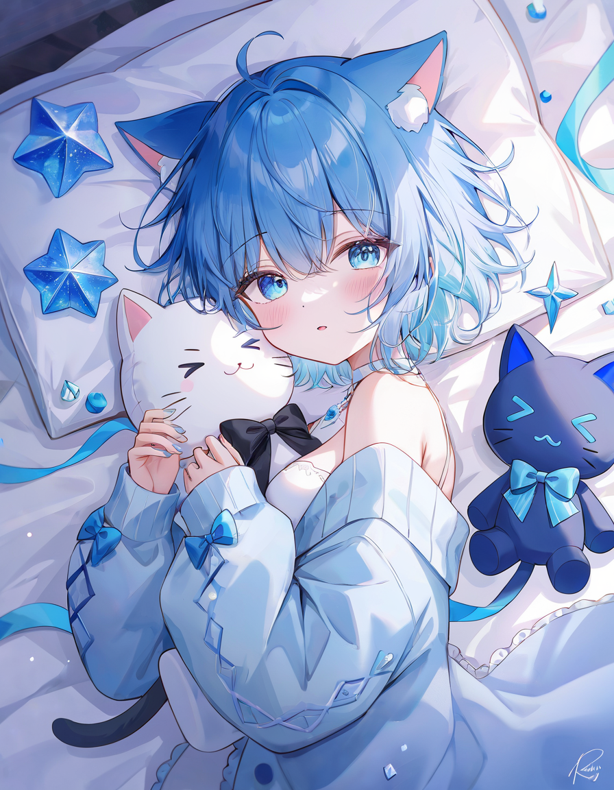

# Hi, I'm Samuel :cat:

Full-Stack Developer | Software engineer :robot:. (In progress)

Revou Student. :man_technologist:

## About me 

:heart: Gaming | :black_heart: Music | :blue_heart: Programming

- 🌍 I'm from kudus - indonesia
- :video_game: I like to play video games
- :gem: I love to customize everything lol

I am a web developer with years of experience in creating and managing websites. My skills include coding in HTML, CSS, and JavaScript, as well as working with ERPs like WordPress and PROGRESS 4GL. I am also experienced in using server-side scripting languages like PHP and C#. I am confident in my abilities and am always looking for new challenges and opportunities to grow as a developer. I am excited to share my skills with the world and hope to make a positive impact on the web development community.

## Repository

About this repo is made for my portofolio blueprint and also a task from revou class 

>https://revou-fsse-5.github.io/T2-Samuel-Indra-Wijaya/

## Social media :mailbox_with_no_mail:

---
⭐️ From samuel
